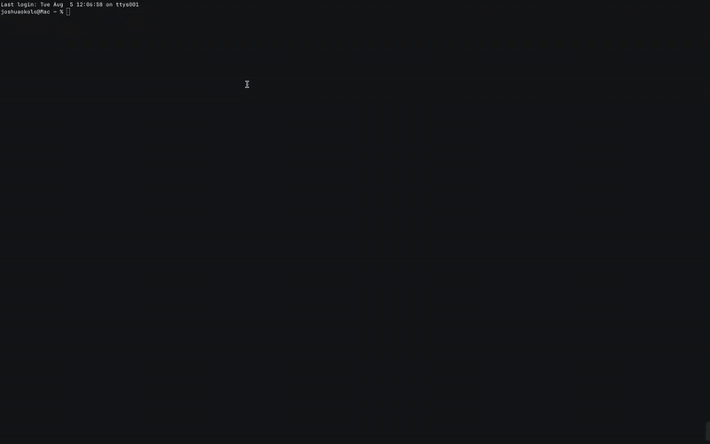
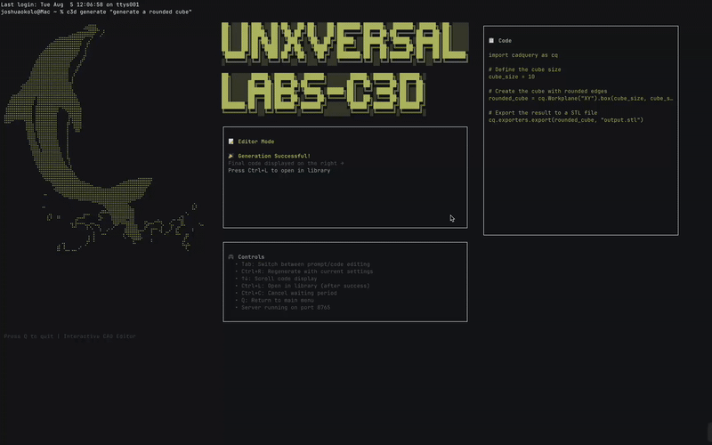
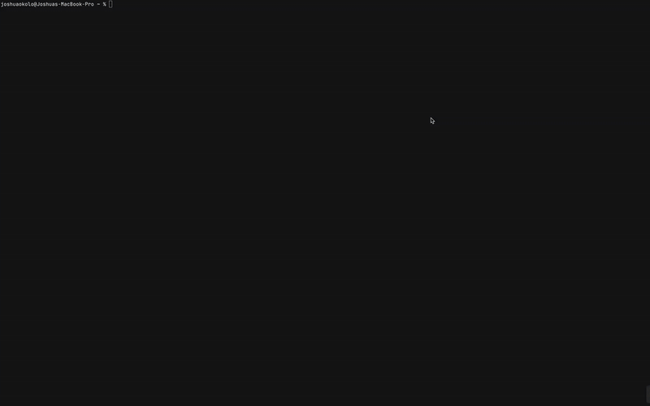
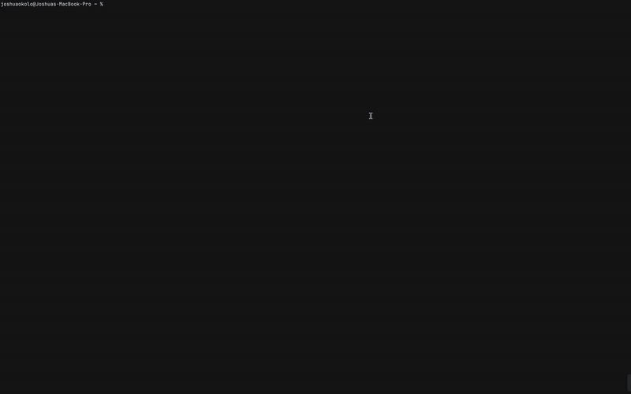
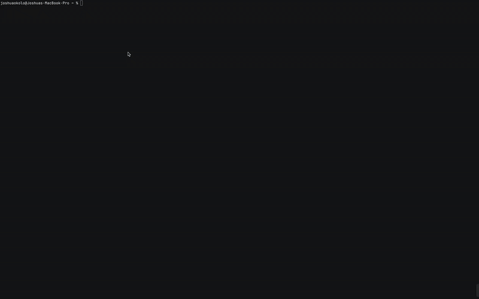

# C3D - AI-Powered 3D CAD Generator

**Compute 3D Lab** - Generate 3D CAD models from natural language descriptions using AI.

 

You can also interact with it as an editor:

 

## ✨ Features

- 🤖 **Interactive AI Generation**: Create CAD models from text with live code editing and re-running
- 🛠️ **Code Editor**: Built-in terminal code editor with syntax awareness and error handling  
- 🔄 **Smart Retry System**: Auto-retry with error context reset for better success rates
- 🌐 **3D Web Viewer**: Interactive React Three Fiber visualization with full mouse controls
- 🖥️ **Beautiful CLI**: Professional terminal interface with streaming responses and animations
- 📁 **Model Library**: Browse, rename, and manage generated STL files with arrow key navigation
- ⚙️ **Configurable**: Persistent settings with interactive config editor
- 📦 **Single Package**: Complete solution bundled into one npm install

## 🚀 Quick Start

### Prerequisites
- **Ollama** ([ollama.ai](https://ollama.ai/))
- **Python** with **uv** ([docs.astral.sh/uv](https://docs.astral.sh/uv/getting-started/installation/))

### Installation
```bash
# 1. Download the C3D model
ollama pull joshuaokolo/C3Dv0

# 2. Start Ollama
ollama serve

# 3. Install C3D CLI
npm install -g @unxversallabs/c3d
```

### Generate Your First Model
```bash
c3d generate "a simple gear with 12 teeth"
```

The 3D viewer will automatically open in your browser with the generated model!

## 📋 Commands

### Core Commands
- `c3d generate <description>` - Interactive CAD generation with live code editing and re-running

- `c3d editor <description>` - Alias for generate (same interactive functionality)

- `c3d viewer` - Launch 3D web interface
  - 

- `c3d server start/stop/status` - Manage backend server with interactive status screens 
  -  

- `c3d config` - Interactive configuration editor with persistent settings
  -  

- `c3d render <script.py>` - Render Python CADQuery scripts with real-time feedback

- `c3d list` - Browse, rename, and manage STL files with arrow key navigation
  -  

### Development & Testing
- `c3d ui` - Launch UI development playground
- `c3d ui static` - ASCII layout slideshow
- `c3d ui shimmer` - Animation effects showcase
- `c3d ui screen <name>` - Test specific screen components
  - Available: `home`, `generation`, `server`, `config`, `render`, `deload`, `error`, `interactive`

### Model Management
- `c3d deload` - Remove AI model from local storage

## 🛠️ Options

- `--port <number>` - Server port (default: 8765)
- `--retries <number>` - Max generation retries (default: 9)
- `--no-viewer` - Disable auto-opening web viewer
- `--output <filename>` - Custom output filename

## 🎯 Examples

```bash
# Interactive generation with code editing and auto-open viewer
c3d generate "a phone case for iPhone 15"

# Same functionality - editor is an alias for generate
c3d editor "a gear with 12 teeth"

# Interactive generation with custom settings and skip viewer
c3d generate "a complex bracket" --retries=6 --no-viewer

# Browse and rename STL files with arrow key navigation  
c3d list

# Interactive configuration with persistent settings
c3d config

# Launch 3D viewer directly
c3d viewer

# Interactive server management
c3d server status

# Test UI components
c3d ui screen generation
```

## 🏗️ Architecture

- **CLI**: Node.js/TypeScript with Ink for terminal UI
- **Frontend**: React + Three.js for 3D rendering
- **Backend**: Python FastAPI with CADQuery engine
- **AI**: Ollama integration for natural language processing

## 📁 Project Structure

```
c3d/
├── cli/c3d/           # Main CLI application
├── frontend/          # React 3D viewer
└── cli/c3d/server/    # Python FastAPI backend
```

## 🔧 Development

### Local Development Setup

If you want to clone and run the project locally:

#### Prerequisites
- **Node.js** (>= 16)
- **Ollama** ([ollama.ai](https://ollama.ai/)) 
- **C3D Model**: Download the specialized model: [joshuaokolo/C3Dv0](https://ollama.com/joshuaokolo/C3Dv0)
- **uv** ([docs.astral.sh/uv](https://docs.astral.sh/uv/getting-started/installation/))
- **Python** (>= 3.8)

#### Clone and Setup
```bash
# 1. Download the C3D model
ollama pull joshuaokolo/C3Dv0

# 2. Start Ollama service
ollama serve

# 3. Clone and build the project
git clone <repository-url>
cd c3d

# Install and build
cd cli/c3d
npm install
npm run build
npm install -g .

# The CLI is now available globally as `c3d`
c3d generate "a simple cube"
```

#### Development Commands
```bash
# Build everything (frontend + CLI)
npm run build

# Build only CLI
npm run build:cli

# Build only frontend
npm run build:frontend

# Watch mode for development
npm run dev
```

See individual README files for detailed development instructions:
- [CLI Development](cli/c3d/readme.md)
- [Frontend Development](frontend/README.md)